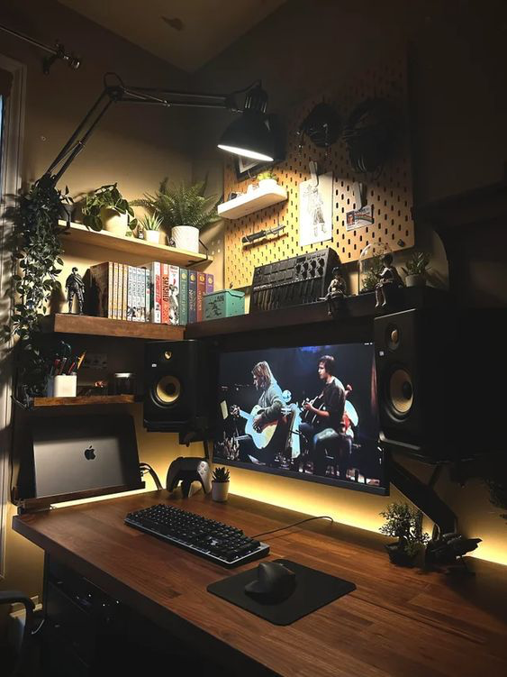
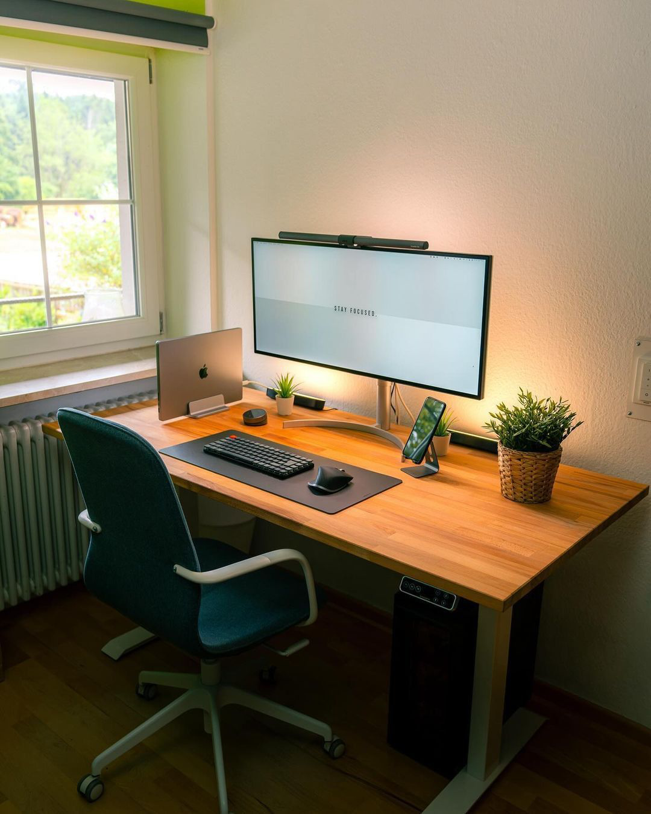
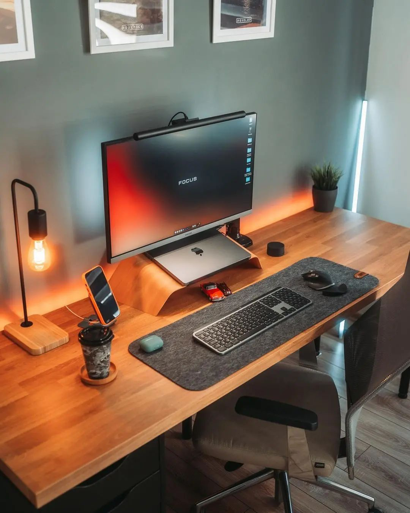
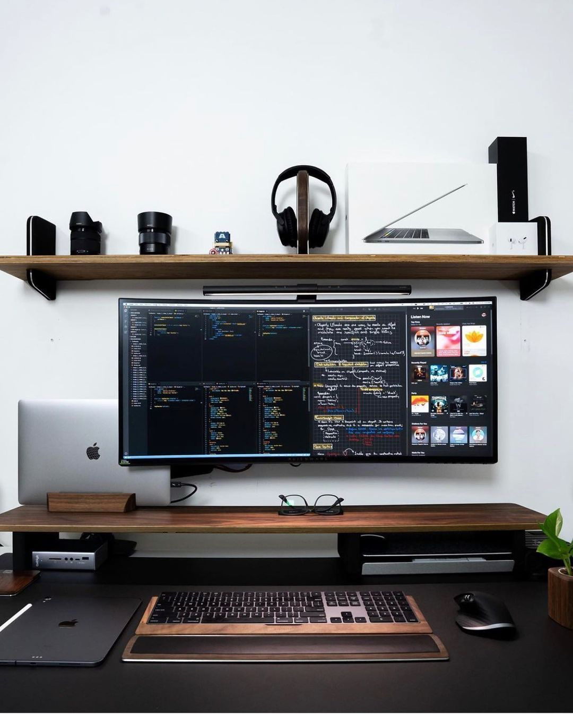
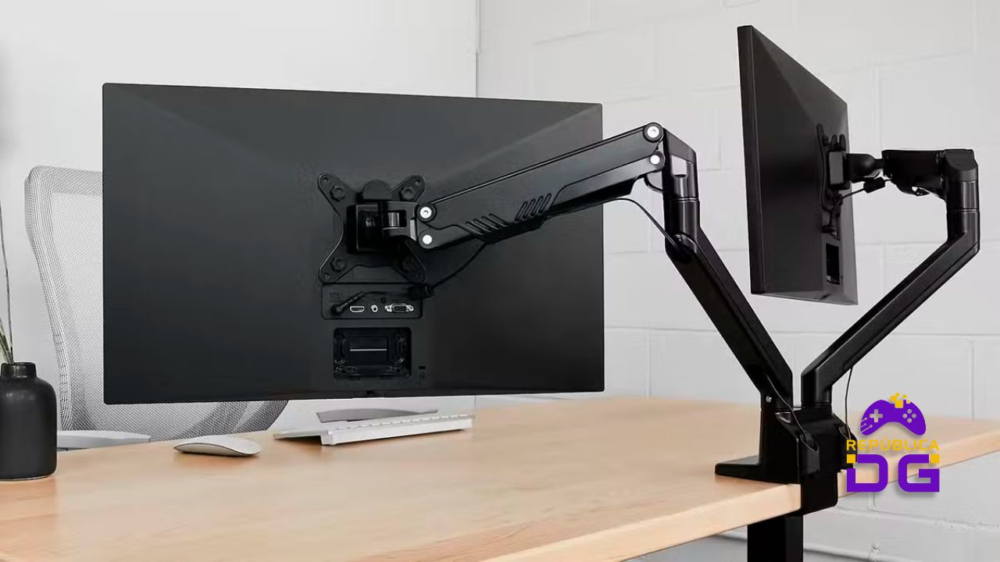
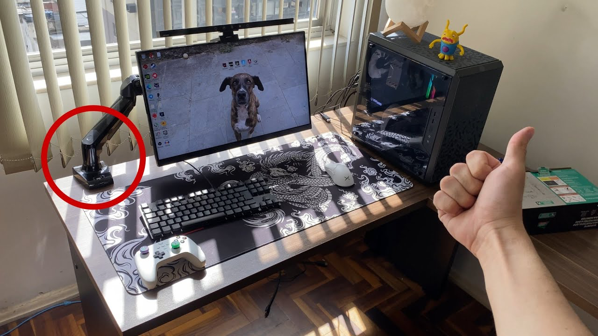
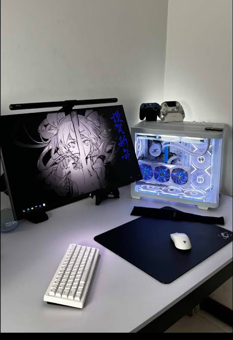
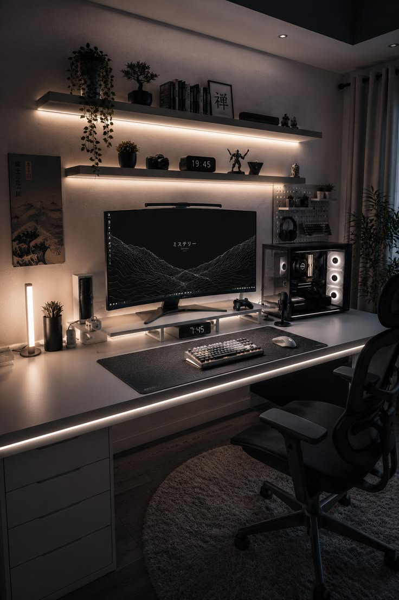

# Revisão R1 — Escritório, suíte e banhos

:material-home-outline: [Início](index.md) › **Revisão R1** &nbsp;·&nbsp; 4 módulos &nbsp;·&nbsp; 23 itens &nbsp;·&nbsp; baseline: ETAPA CRIATIVA APTO M&I

Primeira revisão do projeto de interiores. Trata dos ambientes privativos do apartamento e
referencia, item a item, as páginas do caderno usado como baseline.

[:material-book-open-variant: Como ler este documento](convencoes.md){ .md-button .md-button--primary }
[:material-numeric-2-box-outline: Revisão R2](r2/index.md){ .md-button }

## Módulos

-   :material-desk:{ .lg .middle } &nbsp; **1. Escritório**

    ---

    Bancada, armazenamento, prateleiras e iluminação do posto de trabalho.

    `change`{ .t .t-change } `feat`{ .t .t-feat } `spike`{ .t .t-spike }

    [:octicons-arrow-right-24: 8 itens](#1-escritório)

-   :material-bed-king-outline:{ .lg .middle } &nbsp; **2. Suíte**

    ---

    Paleta, guarda-roupa, penteadeira, cabideiros e sapateiro.

    `change`{ .t .t-change } `feat`{ .t .t-feat } `spike`{ .t .t-spike }

    [:octicons-arrow-right-24: 10 itens](#2-suíte)

-   :material-shower-head:{ .lg .middle } &nbsp; **3. Banho suíte**

    ---

    Toalheiro, tomadas internas, cuba e extensão do armário.

    `change`{ .t .t-change } `feat`{ .t .t-feat } `spike`{ .t .t-spike }

    [:octicons-arrow-right-24: 4 itens](#3-banho-suíte)

-   :material-toilet:{ .lg .middle } &nbsp; **4. Banho social**

    ---

    Suporte para toalhas de banho.

    `feat`{ .t .t-feat }

    [:octicons-arrow-right-24: 1 item](#4-banho-social)

---

## 1. Escritório

> Referência no baseline: **págs. 3 a 8**, sendo a planta de layout na pág. 4 e as perspectivas nas págs. 5 a 8.

### ESC-01. Reposicionamento da bancada principal

`change`{ .t .t-change title="Alteração de algo já projetado" } · pág. 4, págs. 5 a 8

A bancada principal passa para a parede à esquerda de quem entra no ambiente, e o armário passa para a parede à direita da porta.

!!! note "Nota"

    Alteração estruturante do módulo. Os itens `ESC-03` a `ESC-07` partem desta nova disposição e devem ser lidos a partir dela.

!!! aceite "Critério de aceite"

    - [ ] Planta de layout revisada com a bancada na parede esquerda e o armário na parede direita
    - [ ] Circulação e acesso à janela preservados na nova disposição

### ESC-02. Ampliação do armazenamento fechado

`feat`{ .t .t-feat title="Item novo, sem correspondente no baseline" } · págs. 4 a 8

A capacidade de guarda projetada não atende ao uso previsto do ambiente. Como caminho possível, sugerimos um aparador com gavetas sob a janela, sem que isso constitua requisito fechado. A solução final fica a seu critério, desde que amplie o armazenamento fechado.

!!! aceite "Critério de aceite"

    - [ ] Volume de guarda superior ao do baseline
    - [ ] Peça integrada à linguagem da marcenaria existente

### ESC-03. Estudo da prateleira ocupando a parede esquerda inteira

`spike`{ .t .t-spike title="Exige estudo antes de virar decisão" } · págs. 5 a 8 · depende de `ESC-01`

As prateleiras apresentadas foram aprovadas em linguagem e acabamento. Com a nova disposição, pedimos a avaliação de estender essa peça por toda a parede esquerda, seja como prateleiras, seja como nicho, conforme o partido de marcenaria que você julgar mais adequado.

!!! abstract "Escopo do estudo"

    Interessa saber se a solução se sustenta construtivamente e se o resultado visual permanece equilibrado nessa proporção.

!!! aceite "Critério de aceite"

    - [ ] Estudo com a peça correndo de ponta a ponta na parede esquerda
    - [ ] Recomendação explícita a favor ou contra a extensão

### ESC-04. Bancada dimensionada para dois monitores e dois notebooks em posição vertical

`change`{ .t .t-change title="Alteração de algo já projetado" } · págs. 5 a 8 · depende de `ESC-01`

O posto de trabalho deve possuir espaço útil suficiente para acomodar, simultaneamente:

* dois monitores de até 27 polegadas, incluindo suas respectivas bases ou suportes;
* dois notebooks posicionados verticalmente em docks ou suportes apropriados;
* passagem e organização dos cabos de energia, vídeo, dados e demais periféricos.

A disposição dos equipamentos não deve comprometer a área útil de trabalho, a estabilidade dos dispositivos nem o acesso às conexões dos notebooks e monitores. A imagem apresentada deve ser utilizada como referência para o posicionamento vertical dos notebooks.

!!! aceite "Critério de aceite"

    - [ ] Largura e profundidade úteis da bancada compatíveis com dois monitores de até 27 polegadas
    - [ ] Espaço lateral ou traseiro reservado para dois notebooks em posição vertical
    - [ ] Docks ou suportes verticais adequados às dimensões e ao peso dos notebooks (estudo se existe alguma forma de integrar esses notebooks a alguma parte da marcenaria)
    - [ ] Espaço suficiente para conexão e manuseio dos cabos sem dobras excessivas
    - [ ] Organização dos cabos sem interferência na área útil da bancada.

:material-image-multiple-outline: **Imagens de referência**

### ESC-05. Profundidade de bancada ampliada

`change`{ .t .t-change title="Alteração de algo já projetado" } · págs. 5 a 8 · depende de `ESC-01`

A profundidade deve ser folgada em relação ao padrão adotado, de modo a permitir distância confortável de tela e área livre de trabalho à frente do teclado.

!!! aceite "Critério de aceite"

    - [ ] Profundidade especificada acima da do baseline
    - [ ] Circulação resultante validada em planta

### ESC-06. Iluminação de apoio para reuniões por vídeo

`feat`{ .t .t-feat title="Item novo, sem correspondente no baseline" } · págs. 5 a 8 · depende de `ESC-01`

Com a bancada na nova posição, a incidência de luz produz sombra acentuada no lado esquerdo do rosto durante chamadas de vídeo. É necessária uma fonte de luz que corrija esse desequilíbrio, ficando o tipo de luminária e o ponto de instalação a seu critério.

!!! aceite "Critério de aceite"

    - [ ] Iluminação frontal difusa sobre o posto de trabalho.
    - [ ] Ausência de sombra predominante em um dos lados do rosto

### ESC-07. Previsão de fixação para braços articulados de monitor

`feat`{ .t .t-feat title="Item novo, sem correspondente no baseline" } · págs. 5 a 8 · depende de `ESC-01`, `ESC-04`

Os monitores serão instalados em braços articulados, o que impõe dois requisitos ao tampo:

1. **Ponto de fixação.** Tampo e borda dimensionados para receber a garra de fixação ou, alternativamente, furação passante prevista em projeto.
2. **Folga posterior.** Distância entre a borda posterior do tampo e a parede suficiente para que a parte traseira do braço gire em torno do próprio eixo sem colidir.

!!! aceite "Critério de aceite"

    - [ ] Ponto de fixação indicado no detalhamento do tampo
    - [ ] Folga posterior dimensionada e mantida livre de obstrução

:material-image-multiple-outline: **Imagens de referência**

### ESC-08. Ampliação da iluminação indireta

`feat`{ .t .t-feat title="Item novo, sem correspondente no baseline" } · págs. 5 a 8 · depende de `ESC-01`, `ESC-03`

O escritório deve receber mais iluminação indireta e distribuída do que a apresentada, criando diferentes possibilidades de uso e uma atmosfera mais acolhedora. Solicitamos a inclusão de **várias fitas de LED, luminárias e pontos de luz**, integrados à marcenaria e ao ambiente, evitando que a iluminação fique concentrada em uma única fonte.

!!! note "Nota"

    Este item trata da iluminação geral e cênica do escritório e complementa a luz funcional para reuniões por vídeo solicitada em `ESC-06`.

!!! aceite "Critério de aceite"

    - [ ] Fitas de LED previstas em mais de um elemento da marcenaria, quando tecnicamente viável
    - [ ] Luminárias de apoio e demais pontos de luz especificados e posicionados em planta

:material-image-multiple-outline: **Imagens de referência**

---

## 2. Suíte

> Referência no baseline: **págs. 9 a 18**, sendo a planta de layout na pág. 10 e as perspectivas nas págs. 11 a 18.

| ID | Item | Tipo | Depende de |
|---|---|---|---|
| [`STE-01`](#ste-01-substituição-do-verde-por-tom-mais-sóbrio) | Substituição do verde por tom mais sóbrio | `change` | |
| [`STE-02`](#ste-02-guarda-roupa-com-quatro-portas) | Guarda-roupa com quatro portas e mais cabideiros | `change` | |
| [`STE-03`](#ste-03-penteadeira-na-posição-atual-dos-cabideiros) | Penteadeira na posição atual dos cabideiros | `change` | |
| [`STE-04`](#ste-04-led-no-espelho-da-penteadeira) | LED no espelho da penteadeira | `feat` | `STE-03` |
| [`STE-05`](#ste-05-realocação-dos-cabideiros-para-a-parede-atrás-da-porta) | Realocação dos cabideiros para a parede atrás da porta | `spike` | `STE-03` |
| [`STE-06`](#ste-06-divisórias-nas-gavetas-da-penteadeira) | Divisórias nas gavetas da penteadeira | `feat` | `STE-03` |
| [`STE-07`](#ste-07-ampliação-da-iluminação-indireta) | Ampliação da iluminação indireta | `change` | |
| [`STE-08`](#ste-08-portas-do-roupeiro-integralmente-espelhadas) | Portas do roupeiro integralmente espelhadas | `change` | `STE-02` |
| [`STE-09`](#ste-09-definição-da-posição-do-sapateiro) | Definição da posição do sapateiro | `spike` | |
| [`STE-10`](#ste-10-estudo-de-segunda-gaveta-com-divisórias-no-armário) | Estudo de segunda gaveta com divisórias no armário | `spike` | `STE-02` |

### STE-01. Substituição do verde por tom mais sóbrio

`change`{ .t .t-change title="Alteração de algo já projetado" } · págs. 11 a 18

O verde aplicado no ambiente não atendeu à expectativa. A direção é uma cor mais sóbria, com a paleta geral puxada para tons neutros.

!!! aceite "Critério de aceite"

    - [ ] Nova paleta em tons neutros definida
    - [ ] Parede com cor mais neutra/masculina.

### STE-02. Guarda-roupa com quatro portas

`change`{ .t .t-change title="Alteração de algo já projetado" } · págs. 11 a 18

O guarda-roupa passa a ter **quatro portas**, com ampliação da quantidade de cabideiros em sua configuração interna. A nova porta poderá corresponder a um módulo de cabideiros no canto esquerdo, facilitando o acesso às roupas em razão da proximidade com a penteadeira. As demais portas deverão ser deslocadas para a direita(`p + 1`).

!!! aceite "Critério de aceite"

    - [ ] Guarda-roupa com quatro portas
    - [ ] Vista interna com metragem linear de cabide superior à do baseline
    - [ ] Guarda-roupa ocupa a parede de forma integral

### STE-03. Penteadeira na posição atual dos cabideiros

`change`{ .t .t-change title="Alteração de algo já projetado" } · págs. 11 a 18 · acoplado a `STE-05`

A penteadeira sai da posição projetada e assume o lugar hoje destinado aos ganchos.

!!! aceite "Critério de aceite"

    - [ ] Planta e elevação revisadas com a penteadeira na nova posição

### STE-04. LED no espelho da penteadeira

`feat`{ .t .t-feat title="Item novo, sem correspondente no baseline" } · págs. 11 a 18 · depende de `STE-03`

Iluminação em LED integrada ao espelho da penteadeira.

!!! aceite "Critério de aceite"

    - [ ] Detalhamento do espelho com LED

### STE-05. Realocação dos cabideiros para a parede atrás da porta

`spike`{ .t .t-spike title="Exige estudo antes de virar decisão" } · pág. 10, págs. 11 a 18 · acoplado a `STE-03`

Com a penteadeira assumindo o lugar dos cabideiros, a hipótese é transferi-los para a parede atrás da porta. Pedimos que a possibilidade seja analisada antes de virar decisão.

!!! warning "Restrições a verificar"

    Abertura da porta, circulação resultante e leitura estética da parede. Caso alguma delas inviabilize a solução, desconsiderar.

!!! aceite "Critério de aceite"

    - [ ] Parecer de viabilidade
    - [ ] Solução desenhada, se viável

### STE-06. Divisórias nas gavetas da penteadeira

`feat`{ .t .t-feat title="Item novo, sem correspondente no baseline" } · págs. 11 a 18 · depende de `STE-03`

Gavetas da penteadeira compartimentadas internamente.

!!! aceite "Critério de aceite"

    - [ ] Detalhamento interno das gavetas com divisórias

### STE-07. Ampliação da iluminação indireta

`change`{ .t .t-change title="Alteração de algo já projetado" } · págs. 11 a 18

Aumentar a quantidade de luz indireta no ambiente em relação ao que foi apresentado.

!!! aceite "Critério de aceite"

    - [ ] Projeto revisado com mais pontos de iluminação indireta

### STE-08. Portas do roupeiro integralmente espelhadas

`change`{ .t .t-change title="Alteração de algo já projetado" } · págs. 11 a 18 · relacionado a `STE-02`

O roupeiro deve ter espelho em **todas** as portas, e não apenas em parte delas.

!!! aceite "Critério de aceite"

    - [ ] Elevação do roupeiro com a totalidade das portas espelhadas
    - [ ] Compatibilização com o número de portas definido em `STE-02`

### STE-09. Definição da posição do sapateiro

`spike`{ .t .t-spike title="Exige estudo antes de virar decisão" } · págs. 11 a 18

O sapateiro está previsto dentro do armário. Avaliar se ele permanece nessa posição ou se migra para a lavanderia, o que exige verificação prévia do espaço disponível naquele ambiente.

!!! warning "Impacto"

    A decisão altera a configuração interna do armário e deve ser resolvida antes do detalhamento da marcenaria.

!!! aceite "Critério de aceite"

    - [ ] Levantamento do espaço disponível na lavanderia
    - [ ] Parecer comparando as duas hipóteses, com recomendação de qual adotar

### STE-10. Estudo de segunda gaveta com divisórias no armário

`spike`{ .t .t-spike title="Exige estudo antes de virar decisão" } · págs. 11 a 18 · relacionado a `STE-02`

O armário já conta com **uma** gaveta com divisórias para acessórios. Avaliar a possibilidade de haver **duas**, sem prejuízo das demais funções internas do móvel.

!!! aceite "Critério de aceite"

    - [ ] Detalhamento interno das duas gavetas, se viável

---

## 3. Banho suíte

| ID | Item | Tipo | Depende de |
|---|---|---|---|
| [`BSU-01`](#bsu-01-suporte-para-toalhas-de-banho) | Suporte para toalhas de banho | `feat` | |
| [`BSU-02`](#bsu-02-tomadas-internas-nas-gavetas) | Tomadas internas nas gavetas | `feat` | |
| [`BSU-03`](#bsu-03-cuba-de-maior-dimensão) | Cuba de maior dimensão | `change` | |
| [`BSU-04`](#bsu-04-estudo-de-extensão-do-armário-até-o-box) | Estudo de extensão do armário até o box | `spike` | |

### BSU-01. Suporte para toalhas de banho

`feat`{ .t .t-feat title="Item novo, sem correspondente no baseline" } · págs. 21 a 27

Incluir suporte para toalhas de banho com capacidade para **no mínimo duas toalhas em uso simultâneo**, seja em barra única de comprimento suficiente, seja em ganchos independentes.

!!! aceite "Critério de aceite"

    - [ ] Suporte posicionado em planta e elevação
    - [ ] Capacidade mínima de duas toalhas atendida
    - [ ] Acesso direto a partir do box

### BSU-02. Tomadas internas nas gavetas

`feat`{ .t .t-feat title="Item novo, sem correspondente no baseline" } · págs. 21 a 27

Prever pontos de tomada dentro das gavetas do gabinete, permitindo uso e guarda de eletroportáteis sem cabo aparente sobre a bancada.

!!! aceite "Critério de aceite"

    - [ ] Pontos elétricos internos indicados no detalhamento da marcenaria

### BSU-03. Cuba de maior dimensão

`change`{ .t .t-change title="Alteração de algo já projetado" } · págs. 21 a 27

Substituir a cuba especificada por modelo de dimensão maior.

!!! aceite "Critério de aceite"

    - [ ] Nova especificação de cuba definida
    - [ ] Compatibilização com bancada e gabinete verificada

### BSU-04. Estudo de extensão do armário até o box

`spike`{ .t .t-spike title="Exige estudo antes de virar decisão" } · págs. 21 a 27

Hipótese a avaliar: prolongar o armário até o box, com ganho de armazenamento.

!!! failure "Critério de descarte"

    Não se trata de requisito. Caso o resultado fique visualmente pesado ou comprometa a circulação, a extensão deve ser descartada.

!!! aceite "Critério de aceite"

    - [ ] Estudo com a extensão desenhada
    - [ ] Recomendação explícita a favor ou contra

---

## 4. Banho social

> Referência no baseline: **págs. 28 a 34**, sendo a planta de layout na pág. 29.

| ID | Item | Tipo | Depende de |
|---|---|---|---|
| [`BSO-01`](#bso-01-suporte-para-toalhas-de-banho) | Suporte para toalhas de banho | `feat` | |

### BSO-01. Suporte para toalhas de banho

`feat`{ .t .t-feat title="Item novo, sem correspondente no baseline" } · págs. 30 a 34

Mesmo requisito de [`BSU-01`](#bsu-01-suporte-para-toalhas-de-banho) aplicado ao banho social, com capacidade para **no mínimo duas toalhas em uso simultâneo**.

!!! aceite "Critério de aceite"

    - [ ] Suporte posicionado em planta e elevação
- [ ] Capacidade mínima de duas toalhas atendida