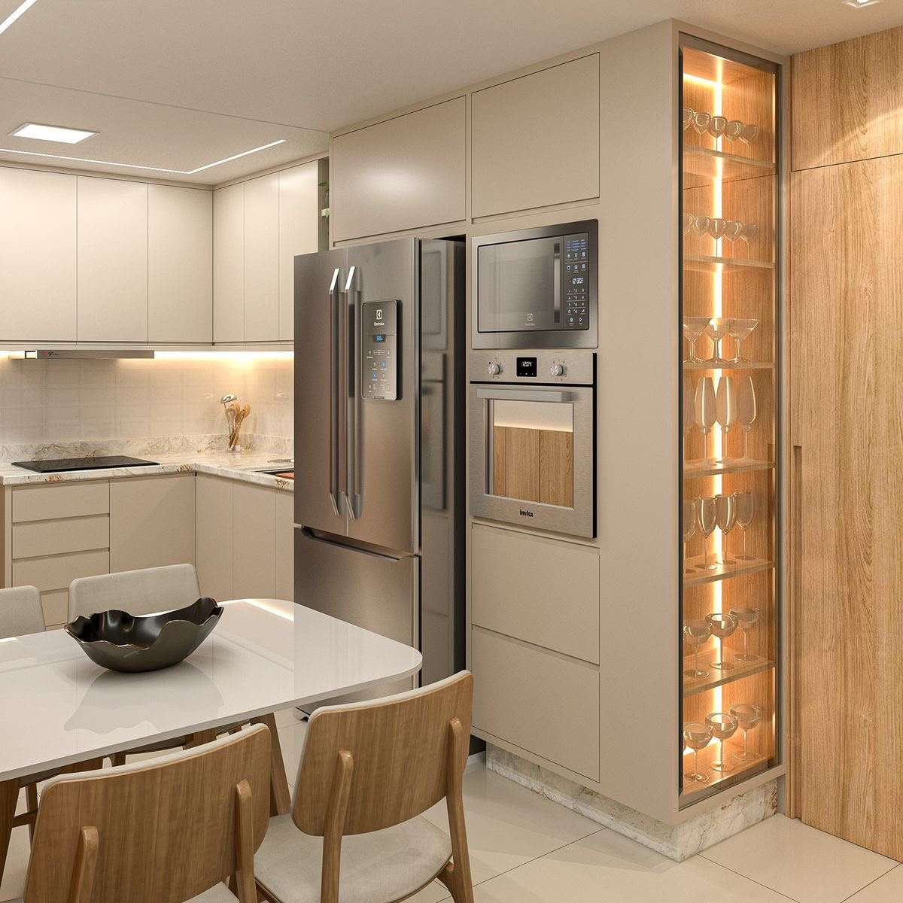
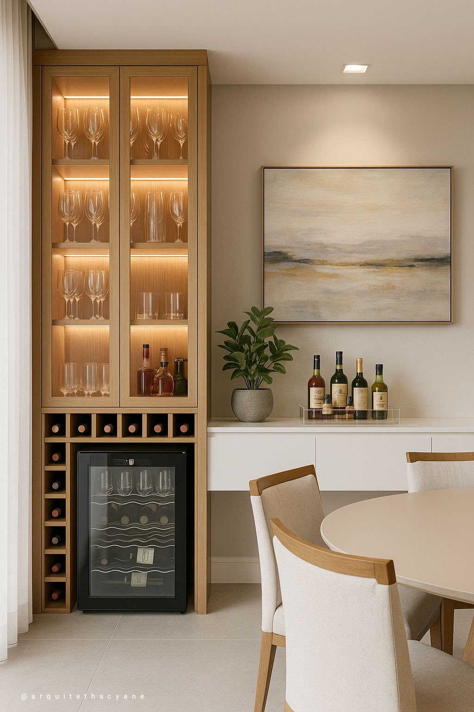

# 2. Cozinha

:material-countertop-outline: [Revisão R2](index.md) › **Cozinha** &nbsp;·&nbsp; 4 itens &nbsp;·&nbsp; [:material-book-open-variant: Como ler](../convencoes.md)

| ID | Item | Tipo | Depende de |
|---|---|---|---|
| [`COZ-01`](#coz-01) | Estudo de troca de posição entre geladeira e torre quente | `spike`{ .t .t-spike } | — |
| [`COZ-02`](#coz-02) | Supressão do passa-pratos | `change`{ .t .t-change } | — |
| [`COZ-03`](#coz-03) | Lixeira embutida na bancada de mármore | `feat`{ .t .t-feat } | — |
| [`COZ-04`](#coz-04) | Estudo de cristaleira voltada para o corredor | `spike`{ .t .t-spike } | relacionado a [`SAL-03`](sala.md#sal-03) |

## COZ-01. Estudo de troca de posição entre geladeira e torre quente { #coz-01 }

`spike`{ .t .t-spike title="Exige estudo antes de virar decisão" }

Avaliar a inversão entre a geladeira e a torre quente, nas duas configurações abaixo, ==na ordem de preferência indicada==.

=== ":material-numeric-1-circle: Hipótese principal"

    A geladeira assume a posição hoje ocupada pela torre quente, reduzindo-se a largura do
    armário lateral caso isso seja necessário para acomodá-la. A torre quente é deslocada para
    a esquerda, passando a ficar ao lado da porta da lavanderia.

    **Configuração preferida.** É a que se busca desenhar primeiro.

=== ":material-numeric-2-circle: Alternativa"

    Caso o deslocamento da torre quente para junto da porta da lavanderia não seja viável, ela
    assume diretamente a posição hoje ocupada pela geladeira, configurando uma permuta simples
    entre as duas peças.

    **Configuração de recurso.** Só entra se a hipótese principal for descartada.

!!! aceite "Critério de aceite"

    - [ ] Estudo desenhado da hipótese principal, com a nova largura do armário lateral indicada
    - [ ] Estudo desenhado da alternativa, caso a hipótese principal se mostre inviável
    - [ ] Recomendação explícita de qual configuração adotar

## COZ-02. Supressão do passa-pratos { #coz-02 }

`change`{ .t .t-change title="Alteração de algo já projetado" }

O passa-pratos deve ser removido do projeto. ==Não há abertura a fechar:== o trecho simplesmente deixa de receber a peça e fica livre.

!!! warning "Ponto de atenção"

    Com a retirada, o único cuidado é conferir se o trecho não fica como uma área vazia grande demais na cozinha. Se ficar, indicar o que ocupa esse espaço, seja marcenaria, seja outro elemento de sua escolha.

!!! aceite "Critério de aceite"

    - [ ] Passa-pratos suprimido de plantas, elevações e perspectivas
    - [ ] Trecho resultante avaliado quanto à proporção de área vazia
    - [ ] Destinação do espaço indicada, caso a área vazia se mostre excessiva

## COZ-03. Lixeira embutida na bancada de mármore { #coz-03 }

`feat`{ .t .t-feat title="Item novo, sem correspondente no baseline" }

A bancada de mármore deve receber lixeira embutida de pequeno porte, do tipo balde, apenas para descarte imediato durante o preparo. ==Não substitui a lixeira principal da cozinha:== o recipiente é raso, encaixado no recorte do mármore e removível pelo tampo para esvaziamento.

!!! aceite "Critério de aceite"

    - [ ] Recorte no mármore detalhado, com tampa alinhada ao tampo
    - [ ] Recipiente de pequeno volume, removível pelo tampo para esvaziamento e higienização
    - [ ] Posição compatível com a área de preparo e com a cuba
    - [ ] Profundidade do recipiente compatível com o gabinete inferior, sem conflito com gavetas e instalações

## COZ-04. Estudo de cristaleira voltada para o corredor { #coz-04 }

`spike`{ .t .t-spike title="Exige estudo antes de virar decisão" } · relacionado a [`SAL-03`](sala.md#sal-03), [`COZ-01`](#coz-01)

Hipótese a avaliar: acomodar a cristaleira na cozinha, com a ==face de exposição voltada para o corredor==, de modo que as peças sejam vistas de fora do ambiente e não a partir da área de preparo.

A referência mais próxima do que se busca é um nicho estreito e vertical, embutido na lateral da torre de marcenaria, fechado em vidro e com iluminação própria. É solução que ocupa pouca área de planta, porque aproveita a espessura de um móvel que já existe.

!!! abstract "Escopo do estudo"

    Interessa saber se a lateral da marcenaria comporta o nicho na profundidade necessária, se a
    face resultante se lê bem a partir do corredor e se a peça não compromete a capacidade de
    guarda do módulo que a recebe. Como a posição da torre de marcenaria é o que se decide em
    [`COZ-01`](#coz-01), o estudo deve partir da configuração recomendada lá.

!!! warning "Decisão conjunta com SAL-03"

    Este item e [`SAL-03`](sala.md#sal-03) são as duas hipóteses para a mesma peça. Podem ser
    descartados individualmente, mas ==não os dois ao mesmo tempo==: o apartamento deve ficar
    com cristaleira na cozinha **ou** na sala. Se ambas as posições se mostrarem ruins, a
    recomendação precisa apontar qual das duas é a menos onerosa e como viabilizá-la.

:material-image-multiple-outline: **Imagens de referência**

/// caption
À esquerda, o partido mais próximo do que se pede: nicho estreito embutido na lateral do
módulo, exposto para fora da cozinha. À direita, um volume fechado com portas de vidro e
guarda de garrafas na base — referência de acabamento e de iluminação, não de posição.
///

!!! aceite "Critério de aceite"

    - [ ] Estudo com a cristaleira posicionada em planta e elevação, com a face de exposição voltada para o corredor
    - [ ] Profundidade disponível na lateral da marcenaria verificada contra a peça
    - [ ] Impacto na capacidade de guarda do módulo que recebe o nicho avaliado
    - [ ] Posição conferida contra a configuração recomendada em [`COZ-01`](#coz-01)
    - [ ] Iluminação da peça prevista, com o ponto elétrico conferido contra [`GER-01`](geral.md#ger-01)
    - [ ] Recomendação explícita a favor ou contra, considerada a decisão conjunta com [`SAL-03`](sala.md#sal-03)
