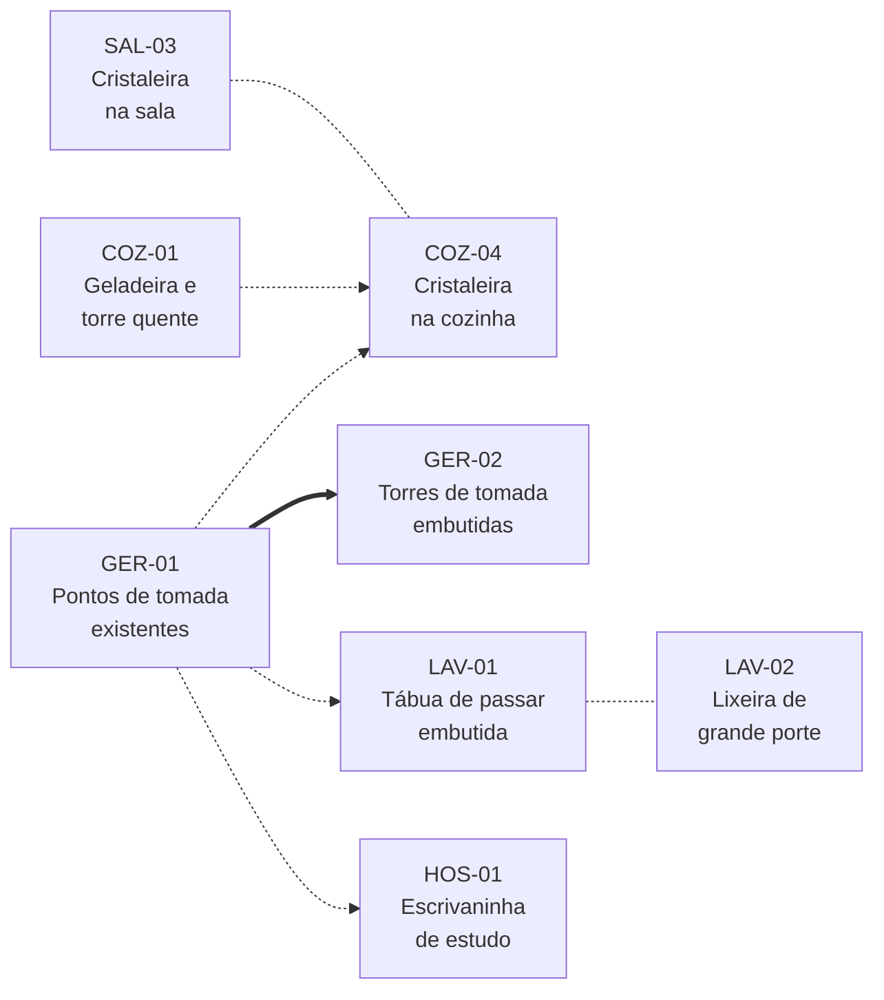

# Revisão R2 — Sala, cozinha e serviço

:material-home-outline: [Início](../index.md) › **Revisão R2** &nbsp;·&nbsp; 5 módulos &nbsp;·&nbsp; 12 itens &nbsp;·&nbsp; baseline não disponível

Complementa a [Revisão R1](../r1.md), que tratou de escritório, suíte, banho suíte e banho
social. Esta revisão trata dos ==ambientes sociais e de serviço== e de um requisito elétrico
transversal a todo o apartamento.

[:material-book-open-variant: Como ler este documento](../convencoes.md){ .md-button .md-button--primary }
[:material-numeric-1-box-outline: Revisão R1](../r1.md){ .md-button }

## Módulos

-   :material-sofa-outline:{ .lg .middle } &nbsp; **1. Sala**

    ---

    Gabinete sob a pia, gaveta oculta no aparador e estudo de cristaleira.

    `change`{ .t .t-change } `feat`{ .t .t-feat } `spike`{ .t .t-spike }

    [:octicons-arrow-right-24: 3 itens](sala.md)

-   :material-countertop-outline:{ .lg .middle } &nbsp; **2. Cozinha**

    ---

    Posição da geladeira, supressão do passa-pratos, lixeira embutida e
    cristaleira voltada para o corredor.

    `change`{ .t .t-change } `feat`{ .t .t-feat } `spike`{ .t .t-spike } `spike`{ .t .t-spike }

    [:octicons-arrow-right-24: 4 itens](cozinha.md)

-   :material-washing-machine:{ .lg .middle } &nbsp; **3. Lavanderia**

    ---

    Tábua de passar embutida e lugar definido para a lixeira principal.

    `feat`{ .t .t-feat } `feat`{ .t .t-feat }

    [:octicons-arrow-right-24: 2 itens](lavanderia.md)

-   :material-bed-outline:{ .lg .middle } &nbsp; **4. Quarto de hóspede**

    ---

    Reformulação da escrivaninha para uso efetivo de estudo.

    `change`{ .t .t-change }

    [:octicons-arrow-right-24: 1 item](hospede.md)

-   :material-power-socket-de:{ .lg .middle } &nbsp; **5. Todos os cômodos**

    ---

    Itens transversais de infraestrutura elétrica já existente.

    `change`{ .t .t-change } `spike`{ .t .t-spike }

    [:octicons-arrow-right-24: 2 itens](geral.md)

## Quadro geral de itens

| ID | Item | Módulo | Tipo | Depende de |
|---|---|---|---|---|
| [`SAL-01`](sala.md#sal-01) | Gabinete sob a pia estendido até o piso | Sala | `change`{ .t .t-change } | — |
| [`SAL-02`](sala.md#sal-02) | Gaveta oculta no aparador da entrada | Sala | `feat`{ .t .t-feat } | — |
| [`SAL-03`](sala.md#sal-03) | Estudo de cristaleira | Sala | `spike`{ .t .t-spike } | relacionado a [`COZ-04`](cozinha.md#coz-04) |
| [`COZ-01`](cozinha.md#coz-01) | Estudo de troca de posição entre geladeira e torre quente | Cozinha | `spike`{ .t .t-spike } | — |
| [`COZ-02`](cozinha.md#coz-02) | Supressão do passa-pratos | Cozinha | `change`{ .t .t-change } | — |
| [`COZ-03`](cozinha.md#coz-03) | Lixeira embutida na bancada de mármore | Cozinha | `feat`{ .t .t-feat } | — |
| [`COZ-04`](cozinha.md#coz-04) | Estudo de cristaleira voltada para o corredor | Cozinha | `spike`{ .t .t-spike } | relacionado a [`SAL-03`](sala.md#sal-03) |
| [`LAV-01`](lavanderia.md#lav-01) | Tábua de passar embutida | Lavanderia | `feat`{ .t .t-feat } | — |
| [`LAV-02`](lavanderia.md#lav-02) | Lugar para lixeira de grande porte | Lavanderia | `feat`{ .t .t-feat } | — |
| [`HOS-01`](hospede.md#hos-01) | Reformulação da escrivaninha para uso de estudo | Quarto de hóspede | `change`{ .t .t-change } | — |
| [`GER-01`](geral.md#ger-01) | Compatibilização dos pontos de tomada existentes | Todos os cômodos | `change`{ .t .t-change } | — |
| [`GER-02`](geral.md#ger-02) | Torres de tomada nos pontos existentes | Todos os cômodos | `spike`{ .t .t-spike } | [`GER-01`](geral.md#ger-01) |

## Ordem de resolução

/// caption
Seta cheia: dependência declarada. Seta tracejada: item que parte de uma decisão tomada antes,
sem precedência formal. Linha tracejada sem seta: itens que se decidem em conjunto, seja por
compatibilização mútua, seja por serem alternativas entre si. Os demais itens da revisão são
independentes.
///

O levantamento de [`GER-01`](geral.md#ger-01) é o item de partida: quatro dos doze itens
partem dele, direta ou indiretamente. [`SAL-03`](sala.md#sal-03) e
[`COZ-04`](cozinha.md#coz-04) são as duas hipóteses para a cristaleira e se resolvem juntos —
o apartamento deve ficar com a peça em um dos dois ambientes.

## Composição por tipo

| Módulo | Itens | `change`{ .t .t-change } | `feat`{ .t .t-feat } | `spike`{ .t .t-spike } |
|---|---:|---:|---:|---:|
| [Sala](sala.md) | 3 | 1 | 1 | 1 |
| [Cozinha](cozinha.md) | 4 | 1 | 1 | 2 |
| [Lavanderia](lavanderia.md) | 2 | — | 2 | — |
| [Quarto de hóspede](hospede.md) | 1 | 1 | — | — |
| [Todos os cômodos](geral.md) | 2 | 1 | — | 1 |
| **Total** | **12** | **4** | **4** | **4** |

!!! info "Referência de página"

    Diferentemente do R1, os itens desta revisão não trazem referência de página, pois os
    ambientes tratados aqui não constam do caderno usado como baseline naquela revisão. A
    localização de cada item se dá pelo ambiente. As referências de prancha serão incorporadas
    na consolidação, assim que o material correspondente for disponibilizado.
