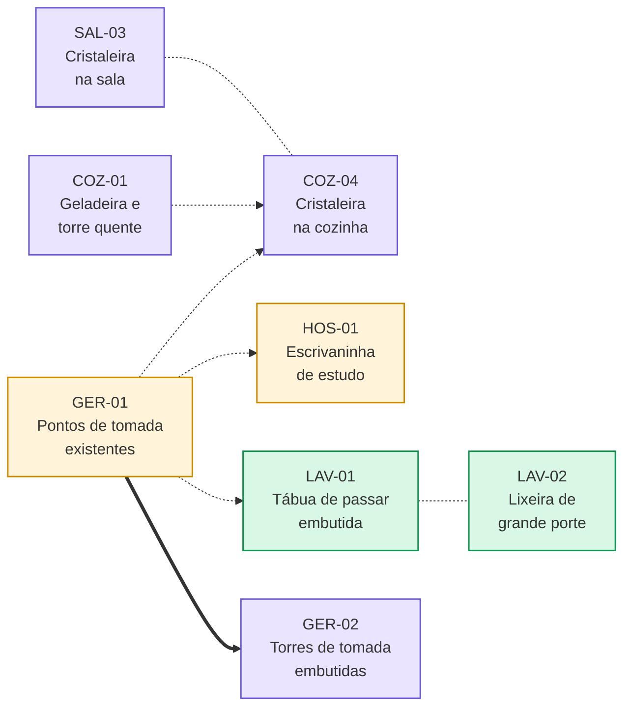

# Revisão 1 — Sociais e de serviço

:material-sofa-outline: [Sociais e de serviço](../index.md) › **Revisão 1** &nbsp;·&nbsp; 5 ambientes &nbsp;·&nbsp; 12 itens &nbsp;·&nbsp; baseline não disponível

Primeira rodada de solicitações para os ==ambientes sociais e de serviço==, mais um requisito
elétrico transversal a todo o apartamento. Corre em paralelo à
[Revisão 1 dos privativos](../../privativos/r1/index.md), que trata de escritório, suíte e banhos.

[:material-book-open-variant: Como ler este documento](../../convencoes.md){ .md-button .md-button--primary }
[:material-view-dashboard-outline: Painel do bloco](../index.md){ .md-button }

5Ambientes

12Itens

4Change

4Feat

4Spike

<ul class="mix-key">
<li><i class="m-change"></i> 4 alterações de projeto</li>
<li><i class="m-feat"></i> 4 peças novas</li>
<li><i class="m-spike"></i> 4 estudos com parecer</li>
</ul>

A revisão se divide em terços exatos: um terço corrige o que já está desenhado, um terço
acrescenta peça que não existe no projeto e ==um terço ainda não é decisão==, e sim pergunta a
responder com estudo e parecer.

## Mapa da revisão

<section markdown>
1. Sala<small>3 itens</small>
[**SAL-01** Gabinete sob a pia até o piso](sala.md#sal-01){ .pill .p-change }
[**SAL-02** Gaveta oculta no aparador](sala.md#sal-02){ .pill .p-feat }
[**SAL-03** Estudo de cristaleira](sala.md#sal-03){ .pill .p-spike }
</section>
<section markdown>
2. Cozinha<small>4 itens</small>
[**COZ-01** Geladeira e torre quente](cozinha.md#coz-01){ .pill .p-spike }
[**COZ-02** Supressão do passa-pratos](cozinha.md#coz-02){ .pill .p-change }
[**COZ-03** Lixeira embutida no mármore](cozinha.md#coz-03){ .pill .p-feat }
[**COZ-04** Cristaleira para o corredor](cozinha.md#coz-04){ .pill .p-spike }
</section>
<section markdown>
3. Lavanderia<small>2 itens</small>
[**LAV-01** Tábua de passar embutida](lavanderia.md#lav-01){ .pill .p-feat }
[**LAV-02** Lugar para a lixeira principal](lavanderia.md#lav-02){ .pill .p-feat }
</section>
<section markdown>
4. Hóspede/filho<small>1 item</small>
[**HOS-01** Escrivaninha de estudo](hospede.md#hos-01){ .pill .p-change }
</section>
<section markdown>
5. Todos os cômodos<small>2 itens</small>
[**GER-01** Pontos de tomada existentes](geral.md#ger-01){ .pill .p-change }
[**GER-02** Torres de tomada embutidas](geral.md#ger-02){ .pill .p-spike }
</section>

## Ambientes

-   :material-sofa-outline:{ .lg .middle } &nbsp; **1. Sala**

    ---

    Gabinete sob a pia, gaveta oculta no aparador e estudo de cristaleira.

    `change`{ .t .t-change } `feat`{ .t .t-feat } `spike`{ .t .t-spike }

    [:octicons-arrow-right-24: 3 itens](sala.md)

-   :material-countertop-outline:{ .lg .middle } &nbsp; **2. Cozinha**

    ---

    Posição da geladeira, supressão do passa-pratos, lixeira embutida e
    cristaleira voltada para o corredor.

    `change`{ .t .t-change } `feat`{ .t .t-feat } `spike`{ .t .t-spike } `spike`{ .t .t-spike }

    [:octicons-arrow-right-24: 4 itens](cozinha.md)

-   :material-washing-machine:{ .lg .middle } &nbsp; **3. Lavanderia**

    ---

    Tábua de passar embutida e lugar definido para a lixeira principal.

    `feat`{ .t .t-feat } `feat`{ .t .t-feat }

    [:octicons-arrow-right-24: 2 itens](lavanderia.md)

-   :material-bed-outline:{ .lg .middle } &nbsp; **4. Quarto de hóspede/filho**

    ---

    Reformulação da escrivaninha para uso efetivo de estudo.

    `change`{ .t .t-change }

    [:octicons-arrow-right-24: 1 item](hospede.md)

-   :material-power-socket-de:{ .lg .middle } &nbsp; **5. Todos os cômodos**

    ---

    Itens transversais de infraestrutura elétrica já existente.

    `change`{ .t .t-change } `spike`{ .t .t-spike }

    [:octicons-arrow-right-24: 2 itens](geral.md)

## Quadro geral de itens

| ID | Item | Ambiente | Tipo | Depende de |
|---|---|---|---|---|
| [`SAL-01`](sala.md#sal-01) | Gabinete sob a pia estendido até o piso | Sala | `change`{ .t .t-change } | — |
| [`SAL-02`](sala.md#sal-02) | Gaveta oculta no aparador da entrada | Sala | `feat`{ .t .t-feat } | — |
| [`SAL-03`](sala.md#sal-03) | Estudo de cristaleira | Sala | `spike`{ .t .t-spike } | relacionado a [`COZ-04`](cozinha.md#coz-04) |
| [`COZ-01`](cozinha.md#coz-01) | Estudo de troca de posição entre geladeira e torre quente | Cozinha | `spike`{ .t .t-spike } | — |
| [`COZ-02`](cozinha.md#coz-02) | Supressão do passa-pratos | Cozinha | `change`{ .t .t-change } | — |
| [`COZ-03`](cozinha.md#coz-03) | Lixeira embutida na bancada de mármore | Cozinha | `feat`{ .t .t-feat } | — |
| [`COZ-04`](cozinha.md#coz-04) | Estudo de cristaleira voltada para o corredor | Cozinha | `spike`{ .t .t-spike } | relacionado a [`SAL-03`](sala.md#sal-03) |
| [`LAV-01`](lavanderia.md#lav-01) | Tábua de passar embutida | Lavanderia | `feat`{ .t .t-feat } | — |
| [`LAV-02`](lavanderia.md#lav-02) | Lugar para lixeira de grande porte | Lavanderia | `feat`{ .t .t-feat } | — |
| [`HOS-01`](hospede.md#hos-01) | Reformulação da escrivaninha para uso de estudo | Quarto de hóspede/filho | `change`{ .t .t-change } | — |
| [`GER-01`](geral.md#ger-01) | Compatibilização dos pontos de tomada existentes | Todos os cômodos | `change`{ .t .t-change } | — |
| [`GER-02`](geral.md#ger-02) | Torres de tomada nos pontos existentes | Todos os cômodos | `spike`{ .t .t-spike } | [`GER-01`](geral.md#ger-01) |

## Ordem de resolução

/// caption
Seta cheia: dependência declarada. Seta tracejada: item que parte de uma decisão tomada antes,
sem precedência formal. Linha tracejada sem seta: itens que se decidem em conjunto, seja por
compatibilização mútua, seja por serem alternativas entre si. A cor de cada caixa é a do tipo
do item — âmbar para `change`{ .t .t-change }, verde para `feat`{ .t .t-feat }, roxo para
`spike`{ .t .t-spike }. Os demais itens da revisão são independentes.
///

O levantamento de [`GER-01`](geral.md#ger-01) é o item de partida: quatro dos doze itens
partem dele, direta ou indiretamente. [`SAL-03`](sala.md#sal-03) e
[`COZ-04`](cozinha.md#coz-04) estudam a mesma peça em dois ambientes e se respondem juntos: o
parecer diz em qual das duas posições a cristaleira cabe melhor, ou que não cabe em nenhuma.

### Sugestão de sequência

<figure class="dgm" markdown>
<svg viewBox="0 0 720 168" role="img" aria-label="Três frentes de trabalho em sequência: levantamento elétrico, estudos com parecer e detalhamento das peças novas">
<rect class="f-surface" x="8" y="34" width="210" height="94" rx="8"/>
<rect class="f-surface" x="255" y="34" width="210" height="94" rx="8"/>
<rect class="f-surface" x="502" y="34" width="210" height="94" rx="8"/>
<text class="lbl" x="16" y="24">Frente 1 — parte daqui</text>
<text class="lbl" x="263" y="24">Frente 2 — estudos</text>
<text class="lbl" x="510" y="24">Frente 3 — desenho final</text>
<text x="24" y="62">Levantamento elétrico</text>
<text class="cap" x="24" y="80">GER-01 mapeia os pontos</text>
<text class="cap" x="24" y="96">existentes por ambiente e</text>
<text class="cap" x="24" y="112">destrava LAV-01, HOS-01,</text>
<text class="cap" x="24" y="128">COZ-04 e GER-02.</text>
<text x="271" y="62">Quatro pareceres</text>
<text class="cap" x="271" y="80">COZ-01 define a posição da</text>
<text class="cap" x="271" y="96">torre quente; SAL-03 e COZ-04</text>
<text class="cap" x="271" y="112">respondem juntos pela</text>
<text class="cap" x="271" y="128">cristaleira; GER-02 lista torres.</text>
<text x="518" y="62">Peças e revisões</text>
<text class="cap" x="518" y="80">SAL-01, SAL-02, COZ-02,</text>
<text class="cap" x="518" y="96">COZ-03, LAV-01, LAV-02 e</text>
<text class="cap" x="518" y="112">HOS-01 entram em planta,</text>
<text class="cap" x="518" y="128">elevação e detalhamento.</text>
<path class="s-hl" d="M222 81h26"/><path class="s-hl" d="M240 74l8 7-8 7"/>
<path class="s-hl" d="M469 81h26"/><path class="s-hl" d="M487 74l8 7-8 7"/>
</svg>
<figcaption markdown>
Sequência sugerida, não imposta: os itens independentes podem ser desenhados a qualquer
momento, mas nada que dependa de ponto elétrico deve ser fechado antes do levantamento de
[`GER-01`](geral.md#ger-01), e a cristaleira só se resolve com os dois estudos na mesa.
</figcaption>
</figure>

## Composição por tipo

| Ambiente | Itens | `change`{ .t .t-change } | `feat`{ .t .t-feat } | `spike`{ .t .t-spike } |
|---|---:|---:|---:|---:|
| [Sala](sala.md) | 3 | 1 | 1 | 1 |
| [Cozinha](cozinha.md) | 4 | 1 | 1 | 2 |
| [Lavanderia](lavanderia.md) | 2 | — | 2 | — |
| [Quarto de hóspede/filho](hospede.md) | 1 | 1 | — | — |
| [Todos os cômodos](geral.md) | 2 | 1 | — | 1 |
| **Total** | **12** | **4** | **4** | **4** |

!!! info "Referência de página"

    Os itens desta revisão não trazem referência de página: os ambientes tratados aqui não
    constam do caderno **ETAPA CRIATIVA APTO M&I**, que serve de baseline aos privativos. A
    localização de cada item se dá pelo ambiente. As referências de prancha serão incorporadas
    na consolidação, assim que o material correspondente for disponibilizado.

!!! note "Sobre os esquemas desta revisão"

    Os poucos esquemas que acompanham o texto tratam de **decisão, não de forma**: mostram a
    ordem em que os itens se resolvem e os critérios que separam um caminho do outro. Nenhum
    deles desenha a peça, propõe partido ou fixa medida — isso é do detalhamento. As referências
    visuais de acabamento, quando existem, vêm como imagem ou vídeo dentro do próprio item.
